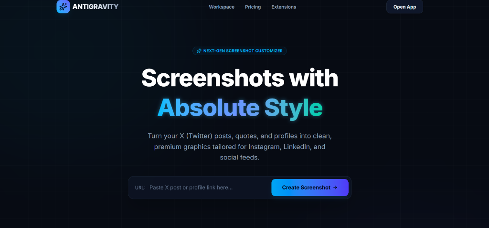
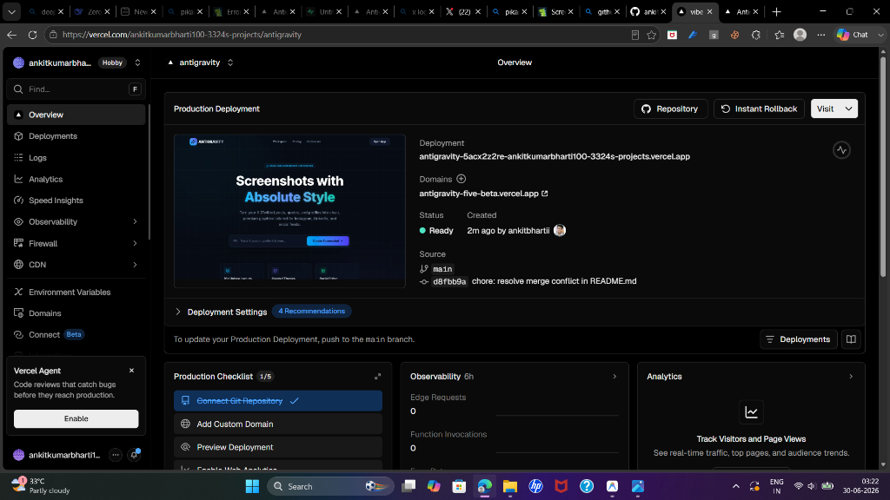

# Antigravity 🌌 (Pikaso Clone)

### 🌐 Live Demo: **[antigravity-five-beta.vercel.app](https://antigravity-five-beta.vercel.app)**

---

<p align="center">
  
</p>

<p align="center">
  
</p>

---

Antigravity is a premium, edge-native web application designed to turn Twitter/X posts and profiles into clean, beautiful screenshots and social media graphics. Built with **Next.js 15**, **Tailwind CSS v4**, **Zustand**, **Upstash Redis**, and **Supabase**, the application allows full customization of sizes, paddings, border radii, layouts, and color themes.

---

## 🚀 Key Features

- **10 Unique Card Layouts**: Standard, Chat Bubble I, Chat Bubble II, Fab Bold, Iconic, Nova I (cyber-monospace), Nova II, Quote Card, Simple Text, and Square Block.
- **Aspect Ratio Sizing**: Format automatically for Instagram Post (1:1), Instagram Story (9:16), or fit-to-bounds (Auto).
- **Interactive Inline Editing**: Double-click directly on the preview card text, usernames, source, verified badge status, and metrics (likes, retweets) to type and customize them on the fly.
- **Custom Profile Avatars**: Click on the profile avatar directly in the canvas to upload and crop a custom image from your local files.
- **SSRF-Safe CORS Proxy**: Built-in router proxying and filtering out private IP blocks to fetch media safely.
- **Edge-Native Satori Rendering**: `/api/og` endpoint converting layouts and swatches to high-res PNG vectors instantly.
- **AI Avatar Upscaler**: Connects to Real-ESRGAN backend servers via RunPod/Modal, with Supabase Storage file caching.

---

## 🛠️ Tech Stack

- **Frontend**: Next.js 15 (App Router), React 19, TypeScript, Tailwind CSS v4, Zustand + Immer, Lucide Icons.
- **Backend / APIs**: Vercel Edge Functions, Zod schema validations.
- **Database & Realtime**: Supabase PostgreSQL + Supabase Realtime CDC, Supabase Storage.
- **Caching**: Upstash Redis (6-hour stale-while-revalidate TTL).
- **Exporting**: Client-side `html-to-image` upscale rasterization.

---

## ⚙️ Environment Configuration

Copy `.env.example` to `.env.local` and populate:

```bash
cp .env.example .env.local
```

Core keys documented:
- `NEXT_PUBLIC_SUPABASE_URL` & `NEXT_PUBLIC_SUPABASE_ANON_KEY`: Supabase API credentials.
- `UPSTASH_REDIS_REST_URL` & `UPSTASH_REDIS_REST_TOKEN`: Upstash caching database REST endpoints.
- `MODAL_API_KEY` / `RUNPOD_API_KEY`: Real-ESRGAN AI avatar upscaler GPU keys (optional).

---

## 📦 Local Installation & Setup

1. **Clone the Repository & Install Dependencies**:
   ```bash
   npm install
   ```

2. **Run the Development Server**:
   ```bash
   npm run dev
   ```
   Open [http://localhost:3000](http://localhost:3000) in your browser.

3. **Initialize the Supabase Database**:
   - Create a new project in your [Supabase Dashboard](https://supabase.com/).
   - Open the SQL Editor in your project and copy-paste the query from `supabase/migrations/20260630_init_schema.sql` to initialize tables, RLS security policies, and realtime broadcast publications.

---

## 🎯 Verification & Testing

- Run TypeScript type checks:
  ```bash
  npx tsc --noEmit
  ```
- Build production optimization bundle:
  ```bash
  npm run build
  ```
